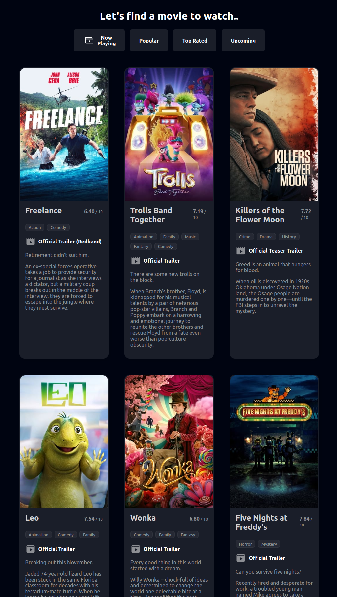
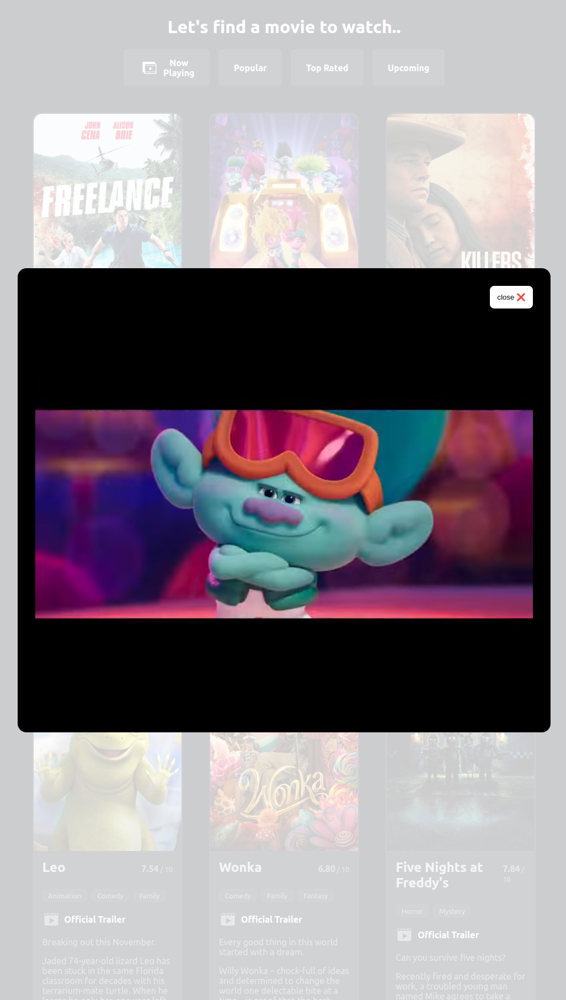

# E04 - Movies




[DEMO](https://wuip-movies.netlify.app/)

```bash
# create React+TypeScript app in the current folder
npx create-react-app . --template typescript

# install dependencies
npm i axios sass
```

```bash
http://localhost:3000/
```

Indent is `Tab` and unindent is `Shift`+`Tab`

API
---

API endpoints that i need to call

- [Now playing](https://developer.themoviedb.org/reference/movie-now-playing-list)
- [Videos (to get trailer videos by movieId)](https://developer.themoviedb.org/reference/movie-videos)
- [Genres (to get genres by genreId)](https://developer.themoviedb.org/reference/genre-movie-list)

```md
# Get a list of movies that are currently in theatres.
GET https://api.themoviedb.org/3/movie/now_playing

# Get the list of official genres for movies.
GET https://api.themoviedb.org/3/genre/movie/list

# Videos
GET https://api.themoviedb.org/3/movie/{MOVIE_ID}/videos

# Get movie details (including genre names) plus videos
https://api.themoviedb.org/3/movie/{MOVIE_ID}?api_key={API_KEY}&append_to_response=videos
```

Links
---

- [TMDB - The Movie DB](https://www.themoviedb.org/)
- [TMDB API Docs](https://developer.themoviedb.org/docs)
- [Axios Docs](https://axios-http.com/docs/intro)
- [Course Notes on TypeScript](https://mapas.pages.labranet.jamk.fi/web-user-interface-programming/01.-Materials/08.-TypeScript/#introduction)
- [Favicon Generator. For real.](https://realfavicongenerator.net/)

Design Inspiration
---

- [Dribbble - Bohdan Kalashnikov](https://dribbble.com/shots/21445115-Moopo-movie-streaming-website)
- [Dribbble - Amara Irobi](https://dribbble.com/shots/19190864-Cinema-Information-Website-Mobile-View)
- [Dribbble - IX Studio](https://dribbble.com/shots/19889469-FilMAX-Movie-Film-Cinema-TV-Template)

TODO
---

- [ ] move fetching weather details to Netlify function. Because "The environment variables exist in the build system alone. They do not exist anymore once the build completes."
- [ ] Add loading states and skeleton screens
- [ ] Trim movie overview text
- [ ] Add Play button on hover
- [x] Fetch videos for every movie
- [x] Find the best video (official, trailer) among the videos array and link to that
- [ ] Play movie trailer on click
- [ ] Add Load More or Infinite Scroll for _Now Playing_
- [ ] Add _Popular_, _Top Rated_ and _Upcoming_ movie lists
- [ ] Fetch smaller images on small devices
- [x] Add manifest icons and update web manifest
- [x] deploy the app to Netlify
- [ ] Show rotten tomatoes and imdb ratings
NOTES
---

- Deleting a freshly installed project takes 7 minutes, all time taken by node_modules. Creating a new one takes a similar amount of time.


What did i learn
---
- How to use index signatures for objects in TypeScript. Index signatures are used when you don't know the names of a type's properties ahead of time (in my case API response objects), but you do know the shape of the values. For example:

```ts
interface StringArray {
  [index: number]: string;
}
```

- `manifest.json` files. How to add a web app manifest, app icons and theme colors.

- how to open and close modals in React apps (specially when you have nested components. Prop drilling is not nice.)

- How to interface with TMDB API


Qs
- How to make sure we have a response from the API before looping over it? So that it doesn't give the error `undefined`.
  - Irrelevant, it was returning undefined because response was a string that we were trying to `map` over. Needed to be parsed as JSON
  - Use an `if () {}` block

- How to use `useContext` so that state is available to children components?
- How to pass methods and actions to children components?
- What component to add the modal to? What component will trigger the modal?

```bash
npm i react-modal
npm i --save-dev @types/react-modal
```

# Deploy to Netlify

```bash
npm run build

# Deploy to a draft URL
netlify deploy --dir 'build/' --message 'deployed with netlify-cli' --open 
# https://652a4c3003f1d6028128e18c--wuip-movies.netlify.app

# If everything looks good on your draft URL, deploy it to your main site URL with the --prod flag.
netlify deploy --dir 'build/' --prod --message 'deployed with netlify-cli' --open 
```

Building with the `command` in `netlify.toml` keeps giving an error, npm run `build` script not found

[All Netlify.toml & yml values](https://gist.github.com/DavidWells/43884f15aed7e4dcb3a6dad06430b756)

---

# Getting Started with Create React App

This project was bootstrapped with [Create React App](https://github.com/facebook/create-react-app).

## Available Scripts

In the project directory, you can run:

```bash
# Run the app in the development mode.
npm start 

# Launch the test runner in the interactive watch mode.
npm test 

# Build the app for production to the `build` folder.
npm run build

npm run eject
```


[Icons](https://thenounproject.com/browse/collection-icon/entertainment-and-movie-solid-streaming-on-screen-127119/?p=1)
- Movie by WEBTECHOPS LLP from <a href="https://thenounproject.com/browse/icons/term/movie/" target="_blank" title="Movie Icons">Noun Project</a> (CC BY 3.0)
- Movie by TTHNga from <a href="https://thenounproject.com/browse/icons/term/movie/" target="_blank" title="Movie Icons">Noun Project</a> (CC BY 3.0)